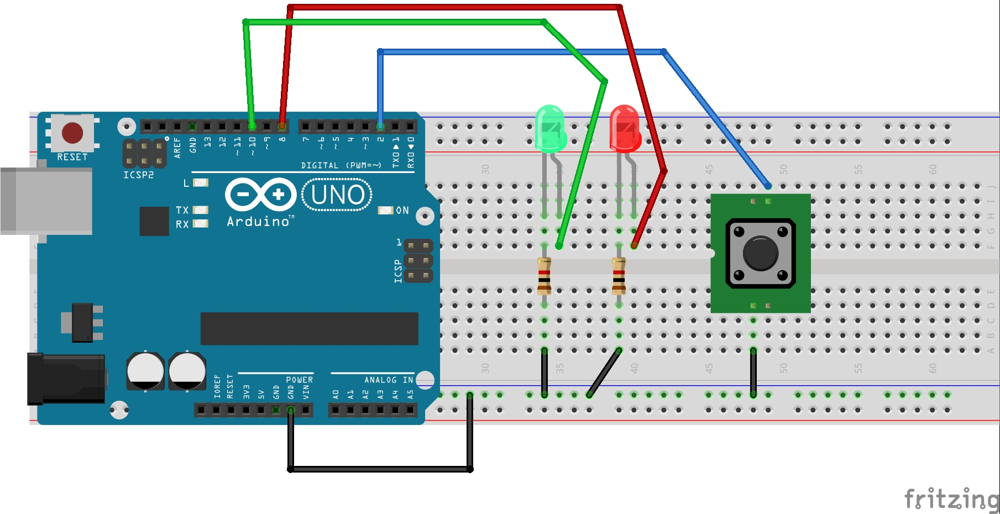
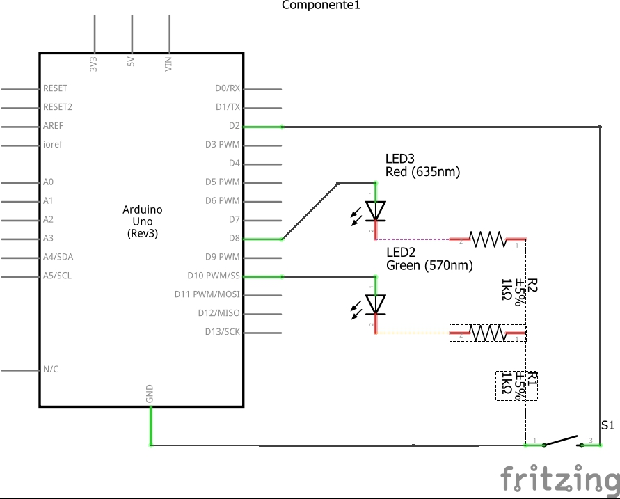

## MONTAGEM NA PROTOBOARD



## 🔖&nbsp; Sobre
Esse sketch tem como objetivo mostrar o uso 
da função millis() em projetos arduino. Fazemos uma comparação de um código semelhante com a função delay e com a mesma montagem, apenas mudamos a programação , implementando a função millis e vendo a diferença nos resultados.

O sketch com código usando a função delay está nesse sketch : - [sketch01](https://github.com/Tiago880/Arduino/tree/main/Millis/Codigo_com_delay) 


O sketch com o código usando a função millis está nesse sketch : - [sketch02](https://github.com/Tiago880/Arduino/tree/main/Millis/Codigo_com_millis) 


# Esquemático


---

## Canal do Youtube

A simulação desse projeto pode ser vista no link 
a seguir : 
- [Video](https://hotm.art/aU22TclL) 

---
## 🖥️ Cursos Recomendados
- [Curso de Arduino](https://go.hotmart.com/B34741498L) 
- [Curso de Robótica](https://go.hotmart.com/A52784638Q)
---

## 📖 Livros Recomendados
- [Arduino Básico](https://amzn.to/3vx6nOo)
- [Programação com Arduino: Começando com Sketches](https://amzn.to/3gNc5Yx)
- [Programação com Arduino II: Passos Avançados com Sketches](https://amzn.to/2S7O2Jm)
- [30 Projetos com Arduino](https://amzn.to/2QLKEDN)

---

## 🗂 Como baixar os projetos

    # Clonar o repositório
    $ git clone https://github.com/Tiago880/Arduino.git

```

---

Desenvolvido por Tiago Cruz


#cursodearduino​
#arduino​
#arduinocomofunciona​
#arduinoparaqueserve​
#arduinoprograma​
#internetdascoisas​
#iot