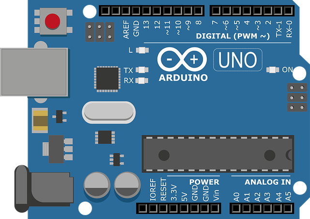

# Indice

- [Sobre](#-sobre)
- [Tecnologias Utilizadas](#-tecnologias-utilizadas)
- [Cursos Recomendados](#-cursos-recomendados)
- [Livros Ulizados](#-livros-utilizados)
- [Como baixar os projetos](#-como-baixar-os-projetos)

## 🔖&nbsp; Sobre

**Arduino** Esse repósitorio tem como objetivo instruir makers
a construir, projetar e aprender sobre o mundo da Internet das coisas. Os projetos são feitos com a plataforma de Desenvolvimento
Arduino. As implementações serão feitas com os mais diversos módulos e sensores de implementação do arduino.

---

## 🚀 Tecnologias utilizadas

O projeto foi desenvolvido utilizando as seguintes tecnologias

- [Linguagem C++](https://docs.microsoft.com/pt-br/cpp/cpp/?view=msvc-160) 
- [Arduino](https://go.hotmart.com/B34741498L)


---
## 🖥️ Cursos Recomendados
- [Curso de Arduino](https://go.hotmart.com/B34741498L) 
- [Curso de Robótica](https://go.hotmart.com/A52784638Q)
---

## 📖 Livros Utilizados
- [Arduino Básico](https://amzn.to/3vx6nOo)
- [Programação com Arduino: Começando com Sketches](https://amzn.to/3gNc5Yx)
- [Programação com Arduino II: Passos Avançados com Sketches](https://amzn.to/2S7O2Jm)
- [30 Projetos com Arduino](https://amzn.to/2QLKEDN)

---

## 🗂 Como baixar os projetos

    # Clonar o repositório
    $ git clone https://github.com/Tiago880/Arduino.git

```

---

Desenvolvido por Tiago Cruz
